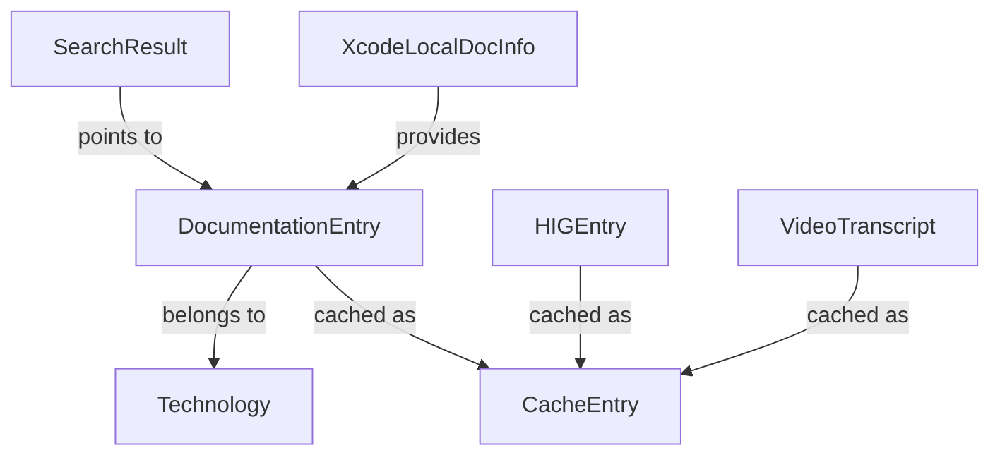

# Data Model: Swift 原生 Apple 文档 MCP 服务器

**Branch**: `001-swift-apple-docs-mcp` | **Date**: 2026-03-13

## Core Entities

### DocumentationEntry (文档条目)

核心实体，表示一份 Apple 官方文档。

| 字段 | 类型 | 说明 |
|------|------|------|
| `identifier` | `String` | 文档唯一标识符 (如 `doc://com.apple.documentation/documentation/swiftui/view`) |
| `title` | `String` | 文档标题 |
| `abstract` | `String?` | 摘要描述 |
| `kind` | `DocumentKind` | 文档类型：class / struct / protocol / enum / function / property / framework |
| `language` | `SourceLanguage` | 编程语言：swift / objectivec |
| `platforms` | `[PlatformAvailability]` | 平台可用性信息 |
| `url` | `URL` | 文档的 Apple 官方 URL |
| `content` | `DocCContent` | 完整的 DocC JSON 内容（延迟加载） |

**验证规则**:
- `identifier` 不可为空
- `url` 必须是有效的 URL

---

### SearchResult (搜索结果)

| 字段 | 类型 | 说明 |
|------|------|------|
| `title` | `String` | 匹配的文档标题 |
| `abstract` | `String?` | 文档摘要 |
| `path` | `String` | 文档路径 (用于 fetch_doc) |
| `kind` | `DocumentKind` | 文档类型 |
| `source` | `DataSource` | 数据来源层级：`.xcode` / `.diskCache` / `.remote` |
| `relevance` | `Double?` | 匹配相关度评分 (0.0 ~ 1.0) |

---

### CacheEntry<T: Codable> (缓存条目)

泛型缓存容器，支持任意 Codable 数据。

| 字段 | 类型 | 说明 |
|------|------|------|
| `key` | `String` | 缓存键 |
| `value` | `T` | 缓存的数据 |
| `createdAt` | `Date` | 创建时间 |
| `expiresAt` | `Date` | 过期时间 |
| `source` | `DataSource` | 数据来源 |

**验证规则**:
- `expiresAt` 必须晚于 `createdAt`
- 过期的条目在查询时自动淘汰

**TTL 预设**:
| 数据类型 | TTL |
|---------|-----|
| 搜索结果 | 30 分钟 |
| 框架文档 | 1 小时 |
| 技术目录 | 2 小时 |
| HIG 内容 | 24 小时 |

**容量策略预设**:
- `MemoryCache` (<String, CacheEntry>)：严格的 LRU (Least Recently Used) 淘汰策略。容量上限默认 100 条目，达到上限时自动淘汰最久未被访问的条目，查找和淘汰操作要求 **O(1)** 时间复杂度。

---

### XcodeLocalDocInfo (Xcode 本地文档信息)

| 字段 | 类型 | 说明 |
|------|------|------|
| `sdkVersion` | `String` | SDK 版本 (如 "iOS 18.0") |
| `platform` | `String` | 平台类型 (iOS / macOS / watchOS / tvOS / visionOS) |
| `cachePath` | `URL` | 本地文档缓存路径 |
| `hasIndex` | `Bool` | 是否有 LMDB 索引 |
| `lastModified` | `Date` | 最后修改时间 |

---

### Technology (技术框架)

| 字段 | 类型 | 说明 |
|------|------|------|
| `name` | `String` | 框架名称 (如 "SwiftUI") |
| `slug` | `String` | URL 路径标识 (如 "swiftui") |
| `description` | `String?` | 框架描述 |
| `languages` | `[SourceLanguage]` | 支持的编程语言 |
| `tags` | `[String]` | 分类标签 |

---

### HIGEntry (HIG 条目)

| 字段 | 类型 | 说明 |
|------|------|------|
| `topic` | `String` | HIG 主题标识 |
| `title` | `String` | 主题标题 |
| `content` | `String` | Markdown 格式的完整内容 |
| `platforms` | `[String]` | 适用平台 |

---

### VideoTranscript (视频转录)

| 字段 | 类型 | 说明 |
|------|------|------|
| `videoID` | `String` | WWDC 视频标识 (如 "wwdc2024-10001") |
| `title` | `String` | 视频标题 |
| `year` | `Int` | 视频年份 |
| `transcript` | `String` | 文字转录内容 |

---

## Enumerations

### DocumentKind

```
enum DocumentKind: String, Codable {
    case framework, class, structure, protocol, enumeration
    case function, property, typealias, associatedtype
    case operator, macro, variable, initializer
    case instanceMethod, typeMethod, instanceProperty, typeProperty
    case article, sampleCode, overview
}
```

### SourceLanguage

```
enum SourceLanguage: String, Codable {
    case swift, objectivec
}
```

### DataSource

```
enum DataSource: String, Codable {
    case xcode       // Xcode 本地文档
    case diskCache   // 磁盘缓存
    case remote      // 远程 API
}
```

## Entity Relationships



## DocC Content Types (Rendering)

DocC JSON 的内容节点树，用于 `DocCRenderer` 渲染为 Markdown：

### DocCContent (根节点)

| 字段 | 类型 | 说明 |
|------|------|------|
| `identifier` | `DocCIdentifier` | 文档标识 |
| `metadata` | `DocCMetadata` | 元数据（标题、角色、平台等） |
| `abstract` | `[InlineContent]?` | 摘要内容 |
| `primaryContentSections` | `[ContentSection]?` | 主要内容段 |
| `topicSections` | `[TopicSection]?` | 主题分组 |
| `relationshipsSections` | `[RelationshipSection]?` | 关系段（Inherits, Conforms To 等） |
| `seeAlsoSections` | `[SeeAlsoSection]?` | 另见段 |
| `references` | `[String: DocCReference]` | 引用表 |

### ContentSection (内容段)

```
enum ContentSection: Codable {
    case declarations(DeclarationsSection)
    case parameters(ParametersSection)
    case content(ContentBlockSection)
    case properties(PropertiesSection)
}
```

### ContentBlock (内容块)

```
enum ContentBlock: Codable {
    case paragraph([InlineContent])
    case heading(level: Int, text: String, anchor: String?)
    case codeListing(syntax: String?, code: [String])
    case aside(style: String, content: [ContentBlock])
    case unorderedList([[ContentBlock]])
    case orderedList([[ContentBlock]])
    case table(header: [[InlineContent]], rows: [[[InlineContent]]])
    case image(identifier: String, caption: [InlineContent]?)
}
```

### InlineContent (行内内容)

```
enum InlineContent: Codable {
    case text(String)
    case codeVoice(String)
    case emphasis([InlineContent])
    case strong([InlineContent])
    case reference(identifier: String, title: String?, isActive: Bool)
    case image(identifier: String)
    case newTerm(String)
    case superscript([InlineContent])
    case subscript([InlineContent])
}
```
